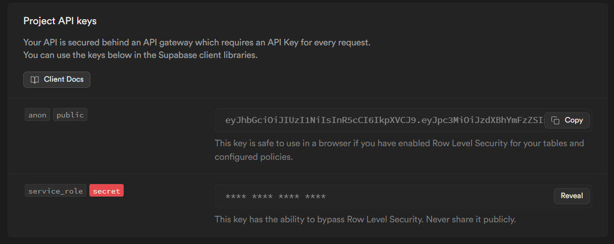

# Adminuser

This project has a signup form where user details are submitted. The submitted user is then displayed in another view where it can be approved by an admin user. The project starts with a default admin user who approves the first submitted user. Upon approval, that user becomes an admin who then approves the next submitted user after them. Users can perform crud operations on the user records that they're admin for(users they approved).

The application has two pages.
```bash
└── app
    └── pages
        ├── auth
        └── users
```

1) **The auth page** contains a sign-up form where user emails are submitted. The emails are saved in a supabase database. After the user is approved, an OTP(temp key) is sent to the email which allows the user to sign in to the application.

2) **The users page** shows a list of submitted users. The list of users are only visible by authenticated users.  
This works as intended when the `anon` key is used in creating the supabase client. The `service_role` key needed to be used in order to have permission to invite other users to the app. The `service_role` is typically supposed to be used on the backend and not exposed in the client.



### Tools
Technology used in building the project include;
- Angular v17: Frontend
- Supabase: backend api & database
- Netlify: deployment

### Credentials
For convenience, disposable emails via [Yopmail](https://yopmail.com/en/) were used for the project. To have access to any of the emails, visit [Yopmail](https://yopmail.com/en/) and in the space to create a mailbox, type in the usernames. E.g. in jerry@yopmail.com, type in `jerry`. Authentications are by OTP.
- Default admin: jerry@yopmail.com

## Development server

Run `ng serve` for a dev server. Navigate to `http://localhost:4200/`. The application will automatically reload if you change any of the source files.

## Code scaffolding

Run `ng generate component component-name` to generate a new component. You can also use `ng generate directive|pipe|service|class|guard|interface|enum|module`.

## Build

Run `ng build` to build the project. The build artifacts will be stored in the `dist/` directory.

## Roadmap

- [ ] sign-up form validation
- [ ] sign-in form validation
- [ ] add interfaces
- [ ] loading spinners in buttons to depict loading state
- [ ] error handling
- [ ] app wide code refactoring
- [ ] route guards
- [ ] UI improvements
- [ ] alert notifications
- [ ] delete operation
